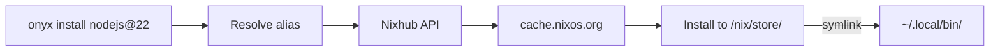

# Onyx

Onyx is a package manager backed by the Nix binary cache — 80,000+ prebuilt packages, installed in seconds. Third-party packages skip Nix entirely — they publish an onyx.toml with download URLs and install directly to `~/.local/bin`.


```bash
onyx install nodejs@22
onyx install go
onyx install username:repo
onyx install example.com
onyx x ruby -- script.rb
```

**Tiny static binary.** Zero dependencies. Works on Linux and macOS.

## Why

Nix has the best package infrastructure ever built — 80,000+ prebuilt packages in a content-addressed binary cache.

Onyx gives you the cache without the overhead. One static binary under 1 MB, no configuration, no new language to learn.

- **Version pinning** — `onyx install node@20` and `node@22` live side by side, each install is atomic
- **Version switching** — `onyx use node@20` flips the active version instantly
- **Run without installing** — `onyx x jq -- '.name' package.json` fetches and runs, `onyx gc` cleans up after 30 days
- **Cross-platform** — same tool, same packages on Linux and macOS
- **Extensible** — third-party packages via simple TOML manifests, no Nix expressions needed

## Quickstart

### Install Onyx

```bash
curl -fsSL https://raw.githubusercontent.com/lilienblum/onyx/master/install.sh | sh
```

Or build from source:
```bash
zig build -Doptimize=ReleaseSmall
cp zig-out/bin/onyx ~/.local/bin/
```

### Setup

```bash
onyx init            # show setup commands
onyx init --exec     # or just run them
```

### Use it

```bash
# Install packages
onyx install nodejs@22
onyx install python
onyx install go@1.22

# Multiple versions coexist
onyx install nodejs@20
onyx use nodejs@20        # switch active version

# Run without installing (auto-fetched, cleaned up by gc after 30 days)
onyx exec jq -- '.name' package.json
onyx x ruby -- script.rb  # x, run are aliases for exec

# Manage
onyx list                 # show installed packages
onyx uninstall python     # remove a package
onyx upgrade              # upgrade all packages + onyx itself
onyx gc                   # clean up unused store paths + expired exec packages
```

Third-party packages (`user:repo`, `domain.com`) skip the nix store entirely and install to `/opt/onyx/packages/`, symlinked into `~/.local/bin`.

## How it works



Aliases (`node` → `nodejs`) are resolved first, then the Nixhub API finds the package, its dependency closure is fetched in parallel from `cache.nixos.org`, unpacked to `/nix/store/`, and symlinked into `~/.local/bin/`.

Third-party packages (`user:repo`, `domain.com`) fetch an `onyx.toml` manifest, download the binary for your platform, verify SHA256, and install directly — no nix store involved.

## Commands

```
onyx install   <pkg>[@version]     Install a package
onyx uninstall <pkg>[@version]     Remove a package (or a specific version)
onyx exec      <pkg> [-- args]     Fetch + run without permanent install
onyx use       <pkg>@<version>     Switch active version
onyx list                          Show installed packages
onyx upgrade   [pkg | --self]      Upgrade packages or onyx itself
onyx gc                            Free disk space
onyx init      [--exec]            One-time /nix/store setup
onyx implode   [--exec]            Remove everything
```

Aliases: `i` install, `rm` uninstall, `x` exec, `ls` list.

## Architecture

```
~/.local/bin/node     →  /nix/store/abc123-nodejs-22.0.0/bin/node
~/.local/bin/my-tool  →  /opt/onyx/packages/my-tool/1.0.0/bin/my-tool

/nix/store/abc123-nodejs-22.0.0/           nix packages + closures
/nix/store/def456-glibc-2.39/
/opt/onyx/packages/my-tool/                third-party packages

~/.local/share/onyx/state.json             package state
~/.cache/onyx/aliases.json                 alias cache
```

## Third-party packages

Packages can publish an `onyx.toml` manifest:

```toml
[package]
name = "my-tool"

["1.0.0".macos]
url = "https://example.com/my-tool-darwin.tar.gz"
sha256 = "abc123..."
bin = ["my-tool"]

["1.0.0".linux-x64]
url = "https://example.com/my-tool-linux.tar.gz"
sha256 = "def456..."
bin = ["my-tool"]
```

Domain-based discovery via HTML meta tag:
```html
<meta name="onyx" content="git https://github.com/user/repo">
```

## Aliases

[`aliases.json`](aliases.json) maps short names to nixpkgs attributes (e.g., `node` → `nodejs`, `pg` → `postgresql`). Cached locally, refreshed daily.

## Building

Requires [Zig](https://ziglang.org/) 0.15+.

```bash
zig build                          # debug build
zig build -Doptimize=ReleaseSmall  # optimized, <1MB
zig build test                     # run tests
```

Cross-compile for any target:
```bash
zig build -Dtarget=x86_64-linux-musl -Doptimize=ReleaseSmall
zig build -Dtarget=aarch64-linux-musl -Doptimize=ReleaseSmall
zig build -Dtarget=x86_64-macos -Doptimize=ReleaseSmall
zig build -Dtarget=aarch64-macos -Doptimize=ReleaseSmall
```

## License

MIT
